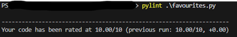
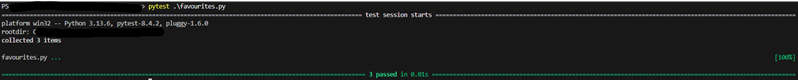
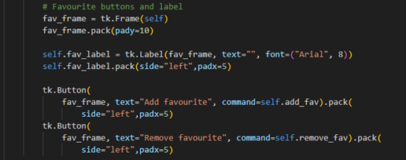
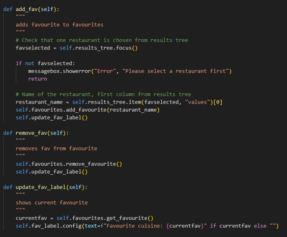

# New feature, favourite cuisine

## User wants to be able to add his/her/? favourite couisine to favourites
- Choose one and only one favourite
- Should be able to add and remove the chosen cuisine from the cuisines shown in the results tree
- Buttons for add and remove
- If favourite exists -> show favourite, else nothing

### Tests written (red phase):

### Implementation of the new feature as stand alone (green phase):

favourites.py:

tests:

### Integrating the feature into the app

main.py:

(buttons and methods for the feature)

integration tests

# Summary

- Defined the expected functionality based on user story
- Created separate tests for the required new feature
- Wrote the most simple and minimum code version to cover the tests
- Scaled / refactored it to follow more on "best practices" (methods, class etc)
- Integrated the feature to the existing app (required buttons and "column" for the new feature)
- Ran tests after integration

    

