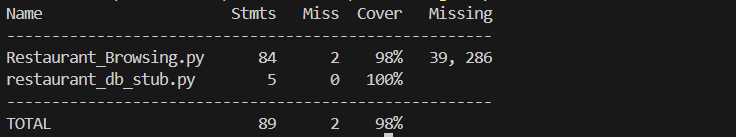
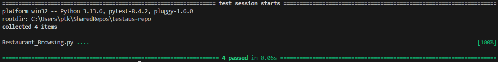
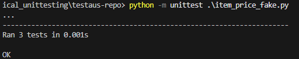

# Software testing Report 2.2
This is report of assignment 2.2 Practucal Unit Testing Frameworks, Mocking, Stubbing and Fakes.

---

### Coverage

---
---

### Mocking
#### Screenshots:

#### Summary:
Mock test checks that order placement handles correctly orders, unavailable items, and payment failures using mocked objects.

#### Reflections:
Making the tests helped me to better understand how to isolate components by using mocks. Mocking is a neat way to test logic without relying on real implementations.

---
---

### Stubbing
Database with incorrect data to check functions behaviour if db query/data is incorrect.

#### Screenshots:

#### Summary:
- Database with incorrect data at restaurant_stub_db.py
- Every existing test enhanced to test search with correct and incorrect db data
    - Helper function run_with_both_dbs to iterate each test with the provided dbs
- Improved functions in restaurant_browsing.py to catch if db data is not valid with another helper function valid_database
    - Check whether db data provided responds with the expected data
    - Catch neg numbers and other incorrect or missing data
    - Handle incorrect data properly calling valid_database on each search function

#### Reflections:
Stubs has a great place and purpose for this kind of usage. Generate false data on purpose and improve the code and tests to handle the scenarios properly.
---
---

### Fakes
#### Screenshots:

#### Summary:
Fake testing for "item_price" is written in different file "item_price_fake". It's functions is same as item_price, but it makes its own file for testing.

#### Reflections:
Fakes is good in unit and integration testing, when tester doesn't want to use real inputs/outputs from the code.

---