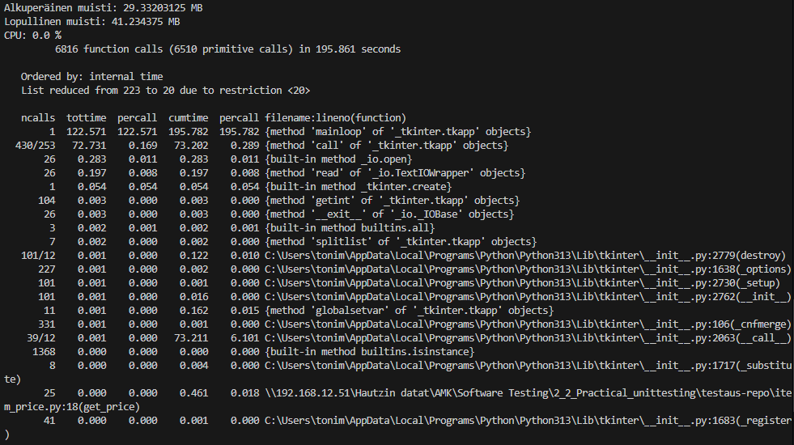

# 3.1 pt1 System Testing Report

## 1. General Information
- **Project:**  Food delivery app
- **Test Date(s):**  12.12.2025
- **Tester(s):**  TH.

---

## 2. Test Objectives
- Test software performance with call durations and used resources

---

## 3. Test Environment
- **Hardware:** Desktop workstation  
- **Operating System(s):** Windows 11 Pro  
- **Test Data:** Simulated  
- **Tools / Frameworks:** Python (cProfile, pstats, psutil, os, time), terminal  

---

## 4. Test Scope
- **In-Scope:** Overall software performance  

---

## 5. Evidence

---

## 6. Conclusions
- Overall performance was good when using the application, call durations where small.
- CPU and RAM usage stays low as shown in picture at evidence section.

---