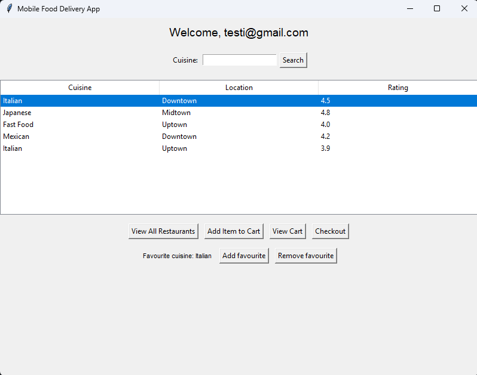

# Usability test for user registeration

## Approach
Test usability in adding and deleting favourites

#### Test:
- Add restaurants to favourites and delete favourites

#### Result and outcome:
- Adding restaurants to favourite is straight forvars, just click wanted restaurant active and press "Add favourite". There is one problem, that you can only add one favourite, adding another overrides earlier favourite.

- Deleting favourite is as simple as adding.

- It would be good to be able to add more than one favourite.

---
##

