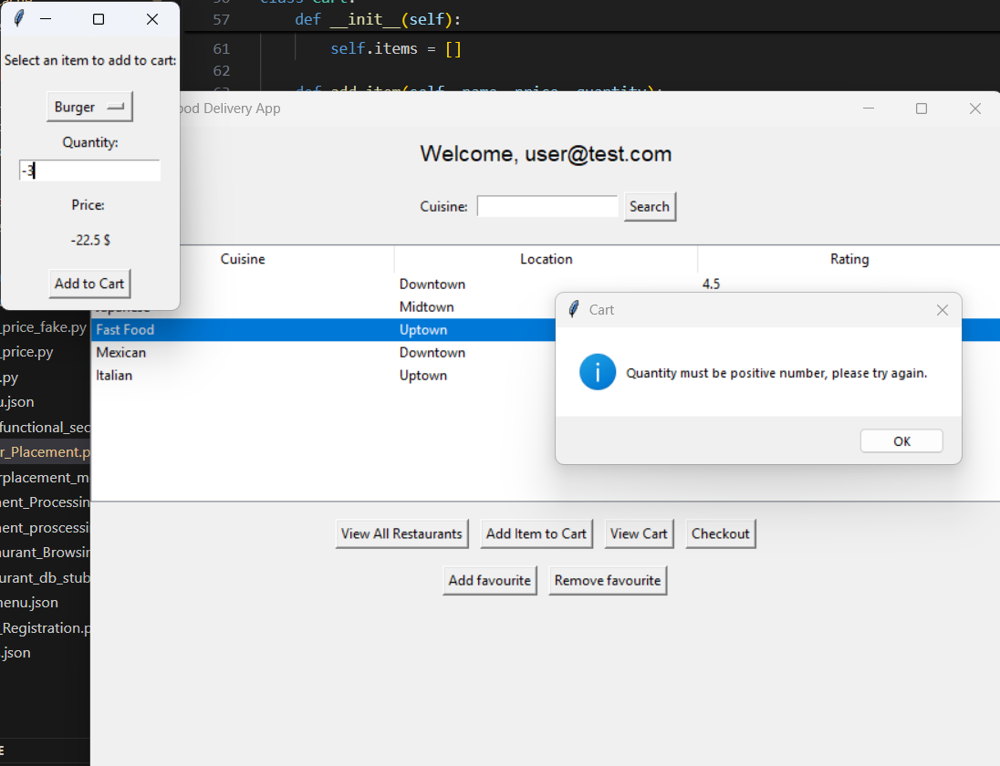
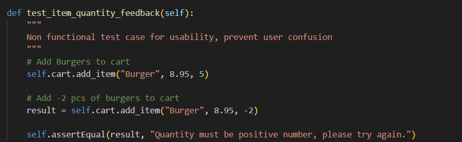
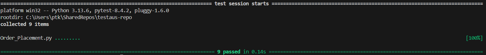

# Integration Testing Report - Usability

## Approach

### Applied a sandwich way of integration testing due to the simultaneously developed integration tests.

#### Ensure that the Cart module integrates with the order functionality without any price or quantity miscalcs or flaws.
- Cart
- items
- order_placement - order execution
- RestaurantMenu

#### Test:
- Handling of invalid quantity input before checkout

#### Result and outcome:
- Negative quantity as input is rejected and doesn't affect the order stage. Therefore prevents corrupted quantity and price.
    - Stable integration behavior

# System Testing Report

## Functional Test

### Confirm that the negative quantity input does not update cart values and the subtotal remains correct.

## Non-Functional Test — Usability

### Scenario as user case:
- User accidentally enters a negative quantity when ordering
    - System informs and guides the user
        - Application returns a clear popup message "Quantity must be positive number, please try again."

### User experience and usage flow remains intact:
- No altered data
- No confusion on user end

## Tests implemented:

| Test Type | Purpose | Result |
| --------- | ------- | ------ |
| Functional | Validate quantity calculation | PASS |
| Non-Functional (Usability) | Validate feedback for user | PASS |

## Summary:

### Code improvements:

### Some test results:

