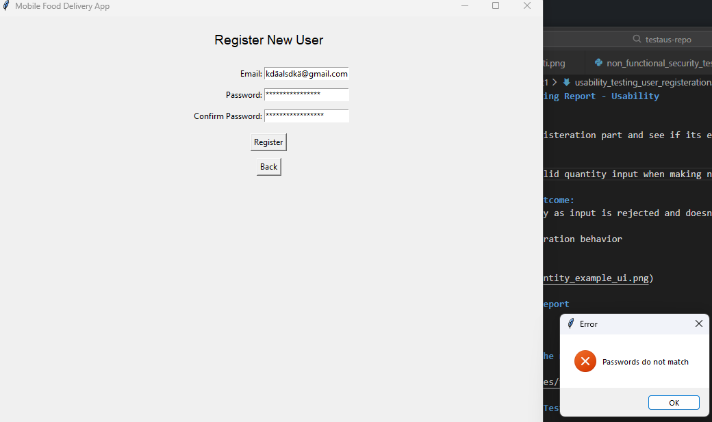
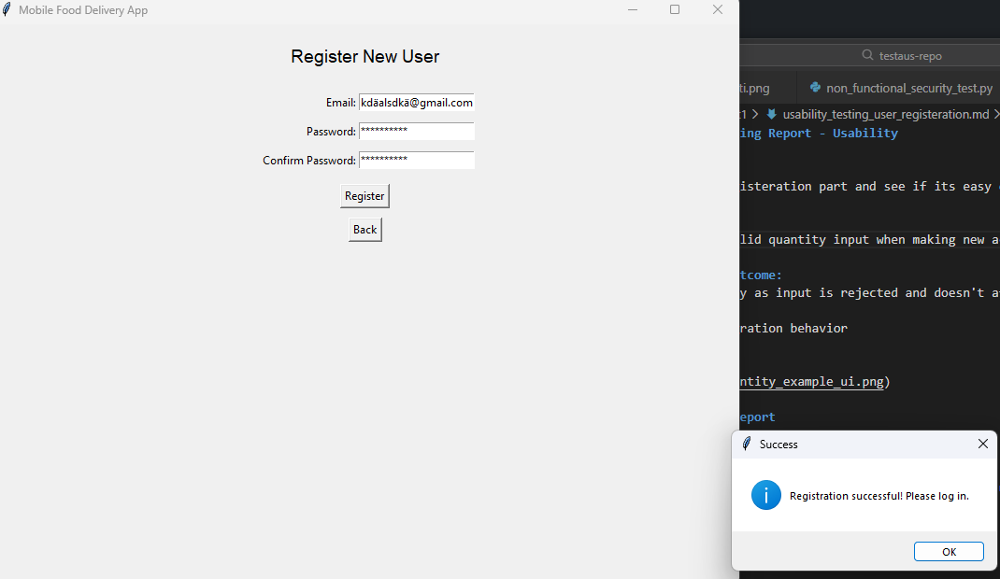
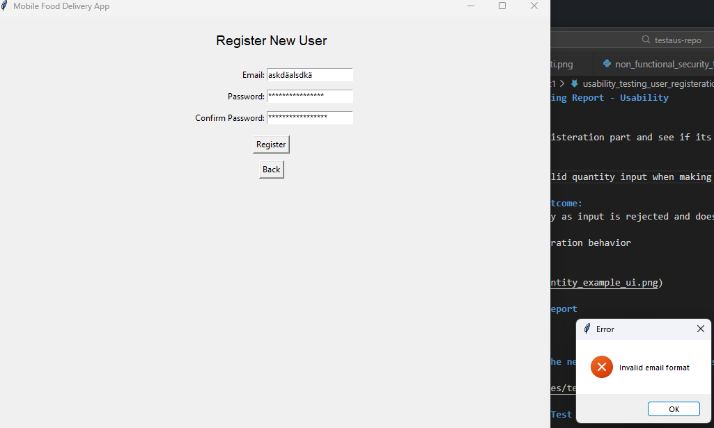

# Usability test for user registeration

## Approach
check the user registeration part and see if its easy enough to use.

#### Test:
- make new accounts with unacceptable information and see how the application handles it

#### Result and outcome:
- The account making process is quite simple enough but users dont get any details for example what does the application would accept as password i tried 16 character password for example and it said password not strong enough i feel like the users should get a bit of a nudge to the right direction for example like "you have to use strong passwords with lowercase, uppercase, numbers and symbols.
- email part is pretty fine as is but if you wanna make it clearer you could you lets say "you have to use real email address" if you put gibberish on it

