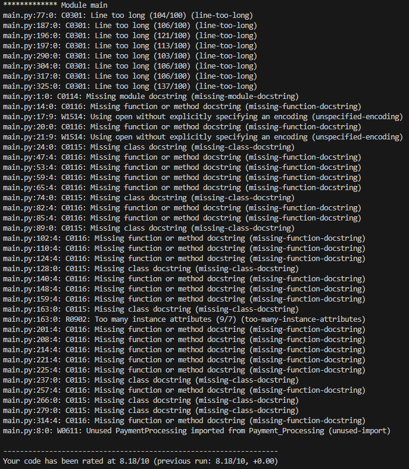
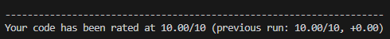

# main.py testing log

## Static testing bugs and defects

- ### High priority
    - Few unspecified encodings: may cause problems in file reading in different environments

    - Docstrings missing: may complicate maintenance, automated analysis and reading the code

- ### Medium proirity
    - Several too long lines: code is more difficult to read

    - Several too many instance attributes: possibly bad planning with objects

- ### Low priority
    - Unused import: unneccessary mess in code

___

## Pylint outcome at beginning:

___

## Fixes due static testing

- ### Unspecified encodings:
    - 'encoding="utf-8"' added to file reading functions

- ### Docstrings missing:
    - Docstrings added to classes and functions/methods

- ### Too long lines:
    - Too long lines splitted

- ### Too many instances:
    - New "OrderData" class created
    - self.user_profile, self.cart, self.restaurant_menu and self.order_placement moved from "MainAppFrame" to "OrderData"
    - PyLint "too-few-public-method" disabled due lack of methods in "OrderData"

- ### Unused import:
    - Deleted unused "PaymentProcessing" import

___
## Pylint outcome after fixes:

___