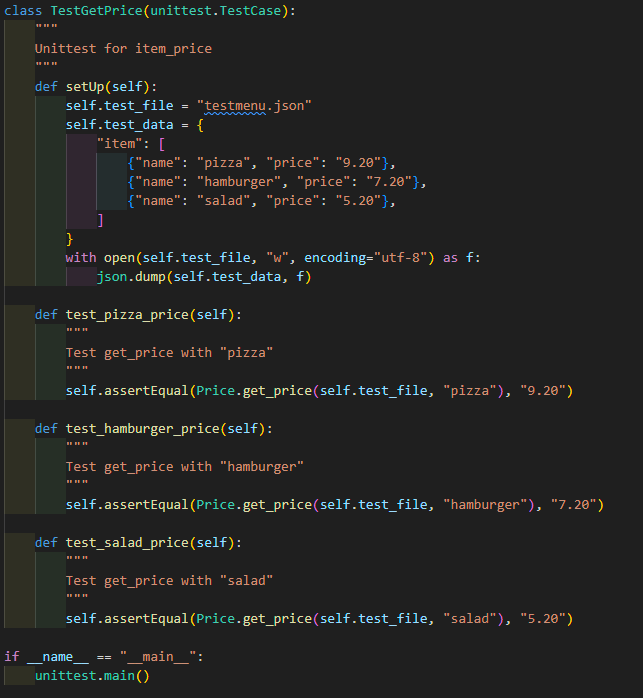
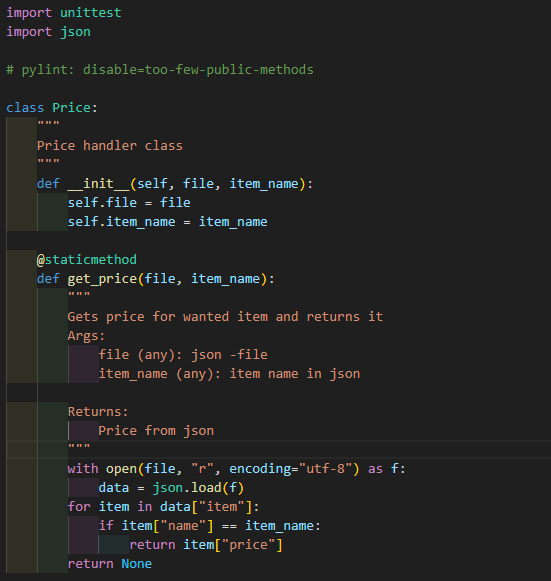
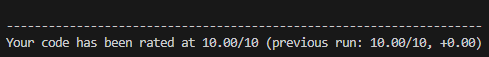
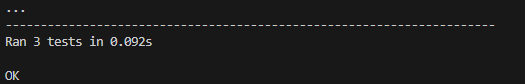
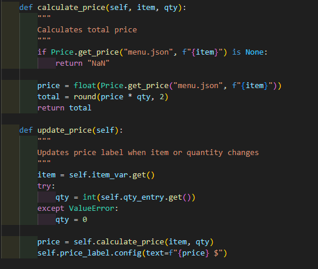
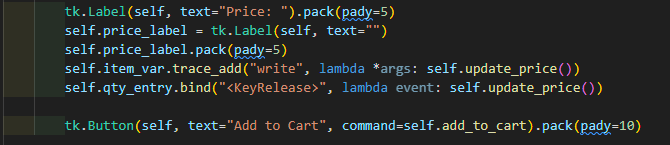
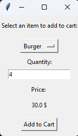
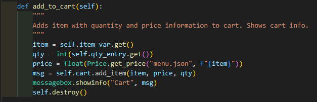
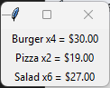
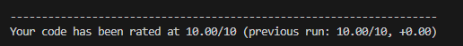

# Requested feature: Price shown before adding item to cart

### User request
- User requested that price is shown before adding item to cart.

### Acceptance criteria
- User is able to wiew price for items before adding items to cart.

### Feature review
- Original code shows price only after item is added to cart. Price is also statically in code so this feature updates prices to external json -file for simplified administration for example in case of price changes. 
- After this update prices will be shown straight in AddItemPopup as users requested.

### Implementation:
- Step 1: Initial tests
- Step 2: Impelmenting basic code
- Step 3: Refractor
- Step 4: Integration to the main code

## Feature creation:

### Test code:

Test code creates new json -file for testing purposes and uses feature code's function to read it. Test tries to get three different item prices from test file.

### Feature code:

Feature itself is static function in new class named "Price". It reads items price from user created json -file by given item name. Json -file's name is given in main code when function is called.

## Tests:

### PyLint:

### Unittest:

Unittest found few typing errors, but i forgot to take screenshots of them. 

## Integration:

Integration to main code needs importing the feature from different file and adding two new functions. Also old code needs little update.

### New functions:

First new function is for calculating the price with item and quantity variables. It uses get_price function from new price class to get correct items price variable. It also rounds price to two decimals preventing possible unnecessary long value from calculation.

Second new function updates price label in tkinter when different item is chosen and/or quantity is changed. It calls calculation function for price value.

### New tk Labels:

New tk labels shows price information for selected item and quantity. Trace and bind lines updates price in cases of item or quantity changes. Calls update function in price changes.

## Integration testing:

Because this is gui app, I tested integration by running the app for testing new feature. This gave me little headache because at first, price label showed only first selected item and not update when item or quantity is changed. After many trials, errors and searches I learn how to make label updating. That leads me to code function "update_price" and new settings for the label.

### New AddItemPopup:

## Add to cart fix:

At first this app has static price 10 for items when adding to cart, I changed it to take price from the json -file so that cart checkout uses prices shown in AddItem window.

### Fixed add_to_cart:

### Working prices in cart:

## Last test:
When everything seems to work properly, I decided to lint the main.py for possible warnings. 

Lint succeeded as image shows:

